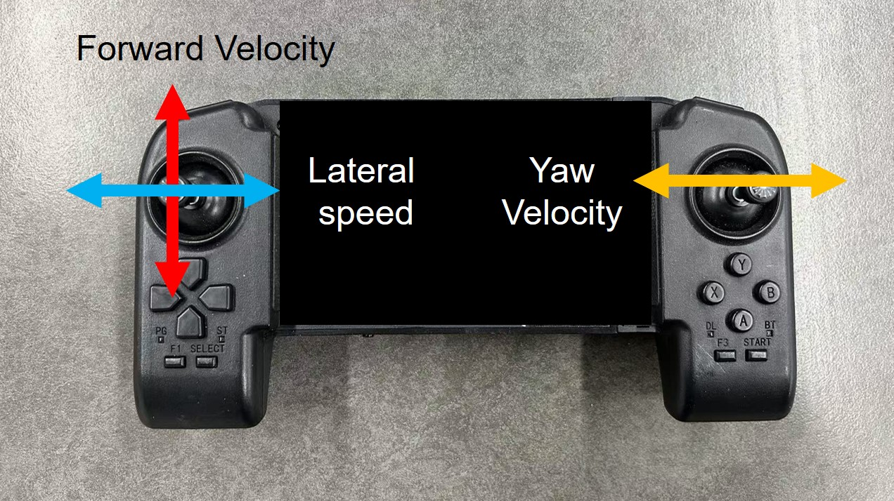
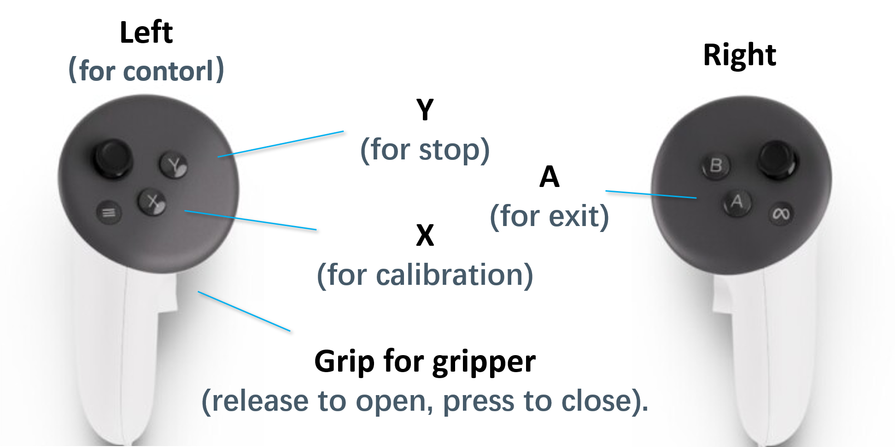
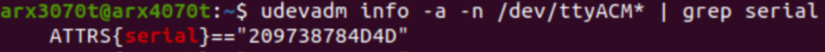

# Unitree Go1/Go2 + ARX5 Deployment

This repository contains the necessary files to deploy policies on the [Unitree Go1/Go2 + ARX5]() mobile manipulation system.

- For Go1+ARX5 deployment, the process is similar to [walk-these-way](https://github.com/Improbable-AI/walk-these-ways/tree/master), using Docker for deployment with added ARX5 low-level interface code.
- For Go2+ARX5 deployment, it is more streamlined, with the low-level interfaces modified according to [walk-these-ways-go2](https://github.com/Teddy-Liao/walk-these-ways-go2).

<b> We’d like to express our gratitude for the open-source contributions that made this possible! </b>

<br>

## Controller
The system uses a remote control for speed control and a VR interface for controlling the end-effector pose. In the future, we plan to improve the system with joystick control for speed. 

<b>Contributions in the form of pull requests (PRs) are welcome!👏</b>


### Velocity contorller
We use the official controller of Unitree to control the speed of the quadruped robot.

<div align="center">
    
</div>

### VR controller
We use Meta Quest 3 to control the end-effector pose of the ARX.


1. Streaming [Meta Quest 3](https://www.meta.com/quest/quest-3/) with [ALVR](https://github.com/alvr-org/ALVR) and [SteamVR](https://store.steampowered.com/steamvr). We mainly use the left handle to control. The key mapping is as follows:

<div align="center">
    
</div>

<br>


<br>

2. Move `vr_streaming.py` into your pc for streaming.

<br>

3. modify the `ip + port` in the `vr_streaming.py` and `remote_pub.py`.
    ```bash
    # NOTE This is the ip and port of the pc host connected to vr
    GLOBAL_IP = "192.168.12.198"
    GLOBAL_PORT = "34565"
    ```
<br>

<br>


## Prepare the ARX dependencies
1. Install the necessary dependencies
    ```bash
    sudo apt install can-utils
    sudo apt install net-tools
    sudo apt-get install libevdev-dev
    ```
2. Configure serial port mapping

    ```bash
    cd ~/go1_gym/go1_arx_deploy/unitree_legged_sdk_bin/arx
    # or 
    # >>> cd go2_arx_deploy/unitree_legged_sdk_bin/arx

    udevadm info -a -n /dev/ttyACM* | grep serial
    ```
    Example:
    <div align="center">
        
    </div>
    
    <br>
    
    Then copy the serial number and modify the `arx_can.rules`:
    ```bash
    # go1_arx_deploy/unitree_legged_sdk_bin/arx/arx_can.rules
    # or 
    # >>> go2_arx_deploy/unitree_legged_sdk_bin/arx_can.rules

    SUBSYSTEM=="tty", ATTRS{idVendor}=="16d0", ATTRS{idProduct}=="117e",
    ATTRS{serial}=="209738784D4D", SYMLINK+="canable0"
    ```
3. Setup
    ```bash
    sudo cp arx_can.rules /etc/udev/rules.d/
    sudo chmod 777 /etc/udev/rules.d/arx_can.rules
    
    sh reopen.sh
    sh reopen.sh  # better run twice
    ```

<br>

## Go1+ARX5
### 1. Prepare the docker environment
Start by following the instructions for [Installing the Deployment Utility](https://github.com/Improbable-AI/walk-these-ways/tree/master?tab=readme-ov-file#installing-the-deployment-utility--), which will guide you through downloading the Docker image. Then, transfer the code to the Go1 device with the IP address unitree@192.168.123.15.
<br>


### 2. Prepare the ARX environment as written at the beginning


### 3. Deploy the policy
<b>📌(Important) Follow these steps in the specified order for proper deployment </b>.

#### Step 1: Enter Damping Mode
Place the robot into damping mode. The control sequence is: [L2+A], [L2+B], [L1+L2+START]. After this, the robot should sit on the ground and the joints should move freely.

#### Step 2: Start the Low-Level Control
```bash
cd ~/go1_gym/go1_gym_deploy/unitree_legged_sdk_bin
sh make.sh
sudo ./lcm_position_vr
```

#### Step 3: Start the rl-policy
```bash
cd ~/go1_gym/go1_gym_deploy/docker
sudo make autostart
```

#### Step 4: start vr-receiver
```bash
cd ~/go1_gym/go1_gym_deploy/
python3 remote_pub.py
```

<br>

## Go2+ARX5
The Go2 code can run on Nvidia Jetson Orin(optional) or PC. We run it on Nvidia Jetson Orin to achieve wireless operation.


### 1. Requirements
#### Install LCM

Clone LCM repository to any location (where you usually place installed softwares), then install LCM:
```bash
git clone https://github.com/lcm-proj/lcm.git
mkdir build
cd build
cmake ..
make
sudo make install
```

#### Unitree_SDK2
Clone the lastest Unitree_SDK2 repository to any location, then install Unitree_SDK2:
```bash
git clone https://github.com/unitreerobotics/unitree_sdk2.git
cd unitree_sdk2
```
To build your own application with the SDK, you can install the unitree_sdk2 to your system directory:
```
mkdir build
cd build
cmake ..
sudo make install
```


### 2. Prepare the ARX environment as written at the beginning
<br>

### 3. Deploy the policy
**(IMPORTANT)** Follow these steps in the specified order for proper deployment:

#### Step 1: Start the Low-Level Control
```bash
cd go2_deployment/go2_gym/go2_gym_deploy/unitree_legged_sdk_bin
sh make.sh
sudo ./lcm_position_vr_go2 eth0
```
Replace `eth0` with your own network interface address. According to the messages shown in terminal, press Enter for several times and the communication between LCM and unitree_sdk2 will set up.

#### Step 2: Start the rl-policy
```bash
cd go2_deployment
python3 go2_deployment/go2_gym/go2_gym_deploy/scripts/deploy_policy_vr.py
```

#### Step 3: start vr-control
```bash
cd go2_deployment/go2_gym/go2_gym_deploy/
python3 remote_pub.py
```
